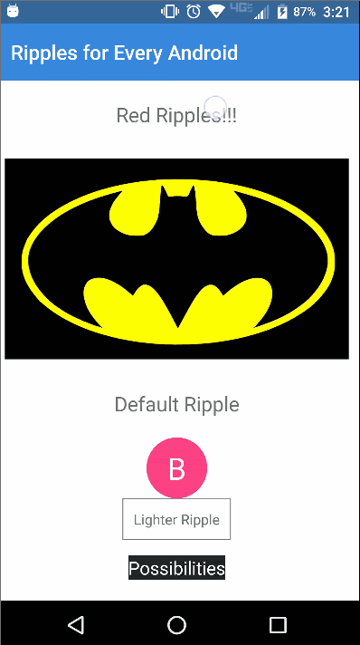

[](https://www.npmjs.com/package/nativescript-ripple)
[](https://www.npmjs.com/package/nativescript-ripple)
[](https://github.com/bradmartin/nativescript-ripple/stargazers)
[](https://github.com/bradmartin/nativescript-ripple/network)
[](https://www.paypal.me/bradwayne88)


# NativeScript-Ripple
NativeScript plugin to add Material Design ripple effects to any layout.


## Installation
From your command prompt/termial go to your app's root folder and execute:

#### NativeScript 3.0+
`tns plugin add nativescript-ripple`

#### NativeScript 2.x 
`tns plugin add nativescript-ripple@1.1.0`

## Demo



### Native Android Library
[Material Ripple](https://github.com/balysv/material-ripple)

## Usage

## XML
```XML
<Page 
  xmlns="http://schemas.nativescript.org/tns.xsd" 
  xmlns:RL="nativescript-ripple" loaded="pageLoaded">
  <ActionBar title="Ripples for Every Android" backgroundColor="#3489db" color="#fff" />
  <ScrollView>
    <StackLayout>

      <RL:Ripple rippleColor="#d50000">
        <Label text="Red Ripples!!!" class="message" textWrap="true" />
      </RL:Ripple>

      <RL:Ripple rippleColor="#fff000">
        <Image src="~/images/batman.png" margin="10" stretch="aspectFit" />
      </RL:Ripple>

      <RL:Ripple>
        <Label text="Default Ripple" class="message" textWrap="true" />
      </RL:Ripple>

      <RL:Ripple rippleColor="#fff" backgroundColor="#FF4081" rippleBorderRadius="30" height="60" width="60">
        <Label text="B" fontSize="30" color="#fff" verticalAlignment="center" horizontalAlignment="center" textWrap="true" />
      </RL:Ripple>

      <RL:Ripple  rippleColor="#c8c8c8" class="label-button">
        <Label text="Lighter Ripple" textWrap="true" />
      </RL:Ripple>

      <RL:Ripple rippleColor="#f5f5f5" margin="15" tap="{{ tapEvent }}" class="dark-button">
        <Label text="Possibilities" color="#fff" padding="10" textWrap="true" />
      </RL:Ripple>
 
    </StackLayout>
  </ScrollView>
</Page>
```

## Attributes
**rippleColor : string** *optional* - sets the ripple color.

**rippleBorderRadius : string** *optional* - sets the radius of the ripple effect. e.g rippleBorderRadius = "30"

## Nativescript + Angular
In the `main.ts` file, add those lines in order to use the ripple effect :

```
import {registerElement} from "nativescript-angular/element-registry";

registerElement("Ripple", () => require("nativescript-ripple").Ripple);
```

Please note that on Android, you can have multiple chlidren under a `<Ripple>` view, but with Ios, the `<Ripple>` view **must** have only one child element.


### Contributors
- Morten Sjøgren @ https://github.com/m-abs **Thanks for iOS support**
